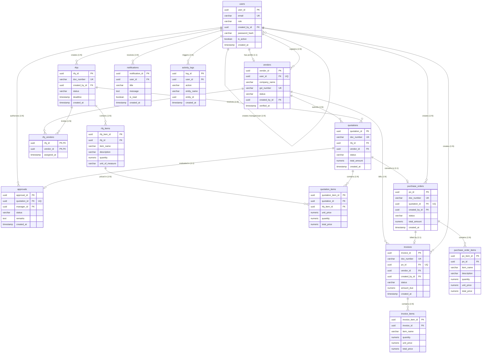

# VendorBridge - Entity Relationship Diagram (ERD)

This document visualizes the database structure of **VendorBridge** Procurement ERP.

## Mermaid ER Diagram

## Relationship Definitions

1. **`users` ↔ `vendors` (One-to-One)**: Each Vendor profile has exactly one associated User credential record (`vendors.user_id` has a unique constraint).
2. **`rfqs` ↔ `rfq_items` (One-to-Many)**: A single Request for Quotation contains multiple distinct line items.
3. **`rfqs` ↔ `vendors` (Many-to-Many via `rfq_vendors`)**: An RFQ is sent to multiple vendors, and a vendor can be assigned to multiple RFQs.
4. **`rfqs` ↔ `quotations` (One-to-Many)**: An RFQ can gather multiple quotation bids, but each bid belongs to exactly one RFQ.
5. **`vendors` ↔ `quotations` (One-to-Many)**: A vendor can submit multiple bids, but a specific bid is unique to one vendor.
6. **`quotations` ↔ `quotation_items` (One-to-Many)**: Each quotation line belongs to one bid submission.
7. **`quotations` ↔ `approvals` (One-to-One)**: Each bid receives a single evaluation record by a Manager.
8. **`quotations` ↔ `purchase_orders` (One-to-One)**: An approved quotation converts to exactly one Purchase Order.
9. **`purchase_orders` ↔ `purchase_order_items` (One-to-Many)**: A PO contains copy snapshots of the awarded bid items.
10. **`purchase_orders` ↔ `invoices` (One-to-One)**: A PO matches to exactly one Invoice request.
11. **`invoices` ↔ `invoice_items` (One-to-Many)**: An invoice contains copy snapshots of the billed elements.
